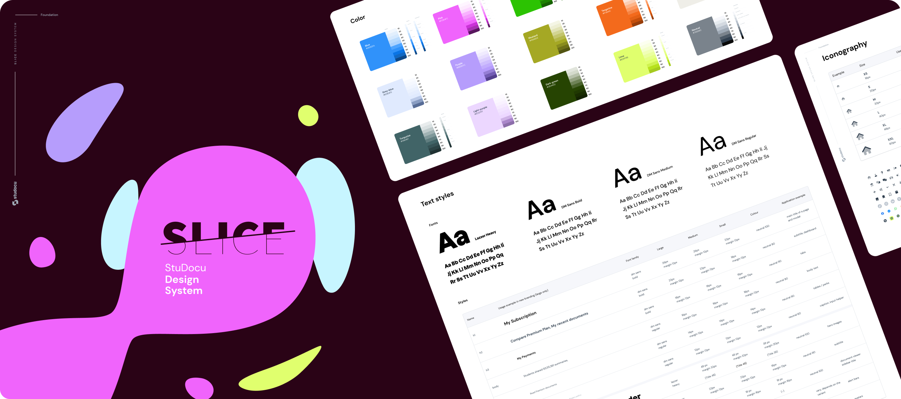

# Slice Design System - Design Tokens



## SLICE? What's that?

SLICE is StuDocu's Design System. It defines the base rules that our design and development teams follow to build pages/components/features for our product(s).

## Where are the SCSS files?

You can generate the SCSS files by running:

```bash
yarn postinstall
```

Our `package.json` contains 2 main tasks which are executed by the `postinstall` task:

* `generate:json` - This task transforms the [tokens extracted/pushed from Figma](./data/tokens.json) into the repository, using the package [token-transformer](https://github.com/six7/figma-tokens/tree/main/token-transformer), and storing it in a format that can be consumed by the other task below.

* `generate:scss` - This task takes picks up the file generated by the previous task and runs its content through a set of transformer functions, configured in src/tokens.config.js, which will generate the SCSS files with the variables and mixins to be used in our project. Makes use of the [style-dictionary](https://github.com/amzn/style-dictionary) package to run these transformer functions.

If you run `yarn postinstall` it'll create the following structure:

```bash
design-figma-tokens
├── mixins
│   ├── _breakpoints.scss
│   ├── _grids.scss
│   ├── _typography.scss
│   └── all.scss
├── transformedTokens.json
└── variables
    ├── _borderRadius.scss
    ├── _breakpoints.scss
    ├── _colors.scss
    ├── _grids.scss
    ├── _shadows.scss
    ├── _spacing.scss
    ├── _typography.scss
    └── all.scss
```

### Why a `postinstall` task?

That way, this repository can be used as a dependency of another, running the token transformation and SCSS generation on the fly.
## How do I add my own transformations?

### Creating a transformer function

Let's go in a step by step process to write a custom transformer function:

```js
module.exports = function myTransformerFunction(input) { /* ... */ }
```

A transformer function is a regular function that receives an object as an input/argument.

This `input` object contains some meta information - such as the file (which contains info about where the output of the transformer function will be stored) or the platform (which contains info about the remaining transformers or files) - but also contains a property called `dictionary` and within it the `properties` property which has all the tokens extracted in the `generate:json` task.

The return of a transformer function is a string, which will be placed in the output file.
Let's change our custom formatter to extract all font sizes from the dictionary. For example, let's say our `input` will have the following format:
```json
{
  "dictionary": {
    "properties":     {
      "0": {
        "value": "10px",
        "type": "fontSizes",
        "filePath": "/design-figma-tokens/transformedTokens.json",
        "isSource": true,
        "original": { "value": "10px", "type": "fontSizes" },
        "name": "font-size-0",
        "attributes": { "category": "fontSize", "type": "0" },
        "path": ["fontSize", "0"]
      },
      "1": {
        "value": "12px",
        "type": "fontSizes",
        "filePath": "/design-figma-tokens/transformedTokens.json",
        "isSource": true,
        "original": { "value": "12px", "type": "fontSizes" },
        "name": "font-size-1",
        "attributes": { "category": "fontSize", "type": "1" },
        "path": ["fontSize", "1"]
      },
      "2": {
        "value": "14px",
        "type": "fontSizes",
        "filePath": "/design-figma-tokens/transformedTokens.json",
        "isSource": true,
        "original": { "value": "14px", "type": "fontSizes" },
        "name": "font-size-2",
        "attributes": { "category": "fontSize", "type": "2" },
        "path": ["fontSize", "2"]
      },
      "3": {
        "value": "16px",
        "type": "fontSizes",
        "filePath": "/design-figma-tokens/transformedTokens.json",
        "isSource": true,
        "original": { "value": "16px", "type": "fontSizes" },
        "name": "font-size-3",
        "attributes": { "category": "fontSize", "type": "3" },
        "path": ["fontSize", "3"]
      },
      "4": {
        "value": "18px",
        "type": "fontSizes",
        "filePath": "/design-figma-tokens/transformedTokens.json",
        "isSource": true,
        "original": { "value": "18px", "type": "fontSizes" },
        "name": "font-size-4",
        "attributes": { "category": "fontSize", "type": "4" },
        "path": ["fontSize", "4"]
      },
      "5": {
        "value": "22px",
        "type": "fontSizes",
        "filePath": "/design-figma-tokens/transformedTokens.json",
        "isSource": true,
        "original": { "value": "22px", "type": "fontSizes" },
        "name": "font-size-5",
        "attributes": { "category": "fontSize", "type": "5" },
        "path": ["fontSize", "5"]
      },
      "6": {
        "value": "26px",
        "type": "fontSizes",
        "filePath": "/design-figma-tokens/transformedTokens.json",
        "isSource": true,
        "original": { "value": "26px", "type": "fontSizes" },
        "name": "font-size-6",
        "attributes": { "category": "fontSize", "type": "6" },
        "path": ["fontSize", "6"]
      },
      "7": {
        "value": "28px",
        "type": "fontSizes",
        "filePath": "/design-figma-tokens/transformedTokens.json",
        "isSource": true,
        "original": { "value": "28px", "type": "fontSizes" },
        "name": "font-size-7",
        "attributes": { "category": "fontSize", "type": "7" },
        "path": ["fontSize", "7"]
      },
      "8": {
        "value": "38px",
        "type": "fontSizes",
        "filePath": "/design-figma-tokens/transformedTokens.json",
        "isSource": true,
        "original": { "value": "38px", "type": "fontSizes" },
        "name": "font-size-8",
        "attributes": { "category": "fontSize", "type": "8" },
        "path": ["fontSize", "8"]
      },
      "9": {
        "value": "48px",
        "type": "fontSizes",
        "filePath": "/design-figma-tokens/transformedTokens.json",
        "isSource": true,
        "original": { "value": "48px", "type": "fontSizes" },
        "name": "font-size-9",
        "attributes": { "category": "fontSize", "type": "9" },
        "path": ["fontSize", "9"]
      }
    }
  },
  "file": {},
  "platform": {},
  "options": {}
}
```

Our transformer function would be something like this:
```js
// src/utils/scss/myTransformerFunction.transformer.scss.js
module.exports = function myTransformerFunction(input) {
  const tokens = props.dictionary.properties;
  
  // Get all font sizes:
  const fontSizes = tokens.fontSize;
  
  // Let's now make a string as an output with variables
  return Object.entries(fontSizes)
    .map(([key, item) => `$rebranded-font-sizes-scale-${key}: ${item.value};`)
    .join('\n');
}
```

That way, the output of this function would be a file containing the following output:

```scss
$rebranded-font-sizes-scale-0: 10px;
$rebranded-font-sizes-scale-1: 12px;
$rebranded-font-sizes-scale-2: 14px;
$rebranded-font-sizes-scale-3: 16px;
$rebranded-font-sizes-scale-4: 18px;
$rebranded-font-sizes-scale-5: 22px;
$rebranded-font-sizes-scale-6: 26px;
$rebranded-font-sizes-scale-7: 28px;
$rebranded-font-sizes-scale-8: 38px;
$rebranded-font-sizes-scale-9: 48px;
```

### Making our transformer function run in the `postinstall`

In order for a transformer function to be used in the `generate:scss` task/script (which gets used in the `postinstall` script) a change in the `src/tokens.config.js` is required.

1 - First we require the new function on the top
```js
const myTransformerFunction = require(
  './utils/scss/myTransformer.transformer.scss.js'
);
```
<br>

2 - Then we add the transformer function to the list of formatters in the configuration:

```js
module.exports = {
  source: [path.join(__dirname, "..", "transformedTokens.json")],
  format: {
    /* ... */
    myTransformerFunction,
  },
  platforms: {
    scss: {
      /* ... */
    },
  },
};
```
<br>

3 - Last but not the least, we add a new file to be created to the list of files in the `platforms.scss.files` array

```js
module.exports = {
  source: [path.join(__dirname, "..", "transformedTokens.json")],
  format: {
    /* ... */
    myTransformerFunction,
  },
  platforms: {
    scss: {
      buildPath: `${path.join(__dirname, "..")}/`,
      transformGroup: "scss",
      files: [
        /* ... */
        {
          destination: "variables/font-sizes.scss",
          format: "myTransformerFunction",
        },
      ],
    },
  },
};
```

Now, if we run the `yarn postinstall` it'll generate all files, including the `variables/font-sizes.scss` generated from our transformer function!